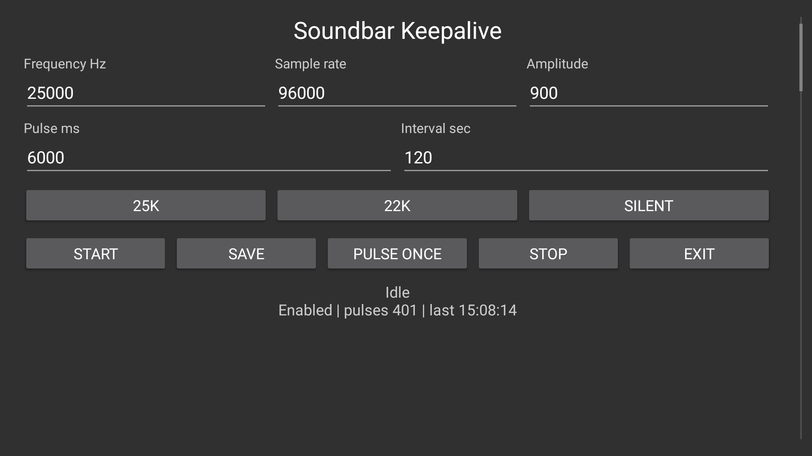

# Android TV Soundbar Keepalive

Some soundbars go to standby when an Android TV sends silence over HDMI ARC for a while. Mine is an older HDMI ARC bar, and it is perfectly fine while something is playing. Pause for long enough and it drops ARC by itself.

This app keeps the TV audio output active by playing a short ultrasonic PCM tone every few minutes. The default is the setup that worked cleanly for me:

```text
22 kHz
48 kHz sample rate
900 / 32767 amplitude
6 seconds
every 1 minute
```

I could not hear the 25 kHz pulse, and Android reported a real `PCM_16_BIT` stream routed to `HDMI_ARC`. On my hardware, though, the bar still ignored or filtered that pulse for standby purposes. 22 kHz at 48 kHz sample rate has been the more useful default so far. Whether a given soundbar treats either signal as activity depends on its input path and standby detector.

## Tested Setup

Tested on one Android TV running Android 12 with an older soundbar over HDMI ARC.

The app should also be useful on other Android TV boxes or TVs where the active `STREAM_MUSIC` route is HDMI ARC, eARC, optical, or another external output. Expect some trial and error.

## Controls

The TV UI lets you set:

- frequency in Hz
- sample rate
- amplitude
- pulse length
- interval

There are also quick presets for `22k`, `25k`, and `Silent`. The silent preset is useful for checking whether an active PCM stream alone is enough for your hardware.

The status line shows whether keepalive is enabled, how many pulses have completed, the last pulse time, the last observed audio route, and the last saved error if one happened.

## Download APK

Grab the latest APK from [Releases](https://github.com/damyan-deshev/android-tv-soundbar-keepalive/releases).

The current APK is debug-signed and meant for sideloading/testing. Android TV will probably ask you to allow installs from your sideloading app or ADB first.

## TV UI



1. Install the APK from Releases, open `Soundbar Keepalive`, and make sure the TV is still using the audio route that goes to your soundbar.
2. Try the default `22K` preset first. `Pulse Once` sends a single test pulse, and `Save` stores the fields without starting the repeating service.
3. Press `Start` to keep sending pulses on the interval and restore it after TV boot. `Stop` disables that restore path. `Exit` just closes the screen, so a running service keeps running.

## Build

Install Android SDK platform/build tools, then point `ANDROID_HOME` or `ANDROID_SDK_ROOT` at the SDK:

```sh
export ANDROID_HOME="$HOME/Library/Android/sdk"
./scripts/build-debug-apk.sh
```

This project currently uses a small shell build script. It needs `aapt2`, `d8`, `zipalign`, `apksigner`, `javac`, and `keytool`.

## Install

With one ADB device connected:

```sh
./scripts/install-debug-apk.sh
```

With a network ADB target:

```sh
export TV_ADB_TARGET="YOUR_TV_ADB_HOST:5555"
./scripts/install-debug-apk.sh "$TV_ADB_TARGET"
```

## ADB Start

The service is exported on purpose in this version, so it can be driven from ADB or a small automation:

```sh
export TV_ADB_TARGET="YOUR_TV_ADB_HOST:5555"
./scripts/start-keepalive-adb.sh "$TV_ADB_TARGET"
```

Override the defaults with environment variables:

```sh
FREQUENCY_HZ=22000 SAMPLE_RATE=48000 AMPLITUDE=1200 DURATION_MS=6000 INTERVAL_SEC=60 \
  ./scripts/start-keepalive-adb.sh "$TV_ADB_TARGET"
```

Stop it:

```sh
./scripts/stop-keepalive-adb.sh "$TV_ADB_TARGET"
```

## Hardware Notes

25 kHz needs a sample rate above 50 kHz, so the `25k` preset uses 96 kHz. If your TV or soundbar filters the signal, try:

- `22000 Hz` at `48000 Hz`
- `21000 Hz` at `48000 Hz`
- `25000 Hz` at `96000 Hz`
- a higher amplitude such as `1500` or `3000`
- the `Silent` preset, in case the hardware only cares about an active PCM stream

Start low. Some TVs, DACs, speakers, pets, or younger ears may react differently to high frequency content.

## Troubleshooting

If the soundbar is off while the app is still running, do not assume Android killed the service. First confirm whether ARC is still established and whether the pulse is routed to `HDMI_ARC` or to the built-in speaker. See [HDMI ARC Troubleshooting Notes](docs/arc-troubleshooting.md) for the observed failure signature and ADB checks.

## Current Rough Edges

The service is `exported=true` so ADB can start it directly. That is convenient for hacking and home automation. If you want a tighter app build, set the service to `exported=false` in `AndroidManifest.xml`.

The app logs two info lines per pulse. Android logcat is a bounded ring buffer, so it should not grow like an app-owned log file. If you want quieter logs, remove the `Log.i` lines in `KeepAliveService.playPulse`.

The app starts itself after boot unless you have pressed `Stop`. `Start` stores the service as enabled, and `Stop` disables that restore path. The default interval is 1 minute because one tested setup dropped ARC before the old 9 minute and 4 minute pulses arrived. The receiver also listens for Android's locked-boot event, which helps on TVs that deliver the normal boot-completed broadcast late.

## License

MIT
